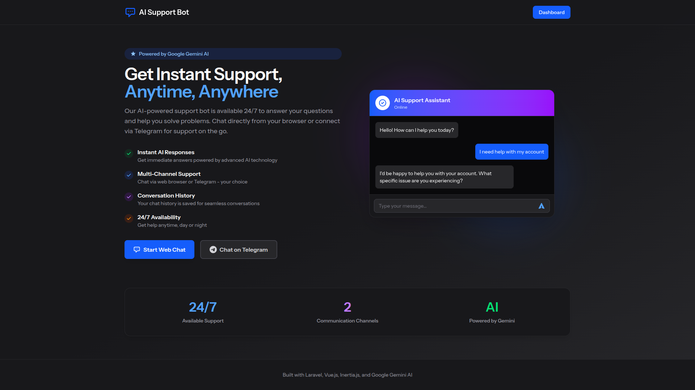
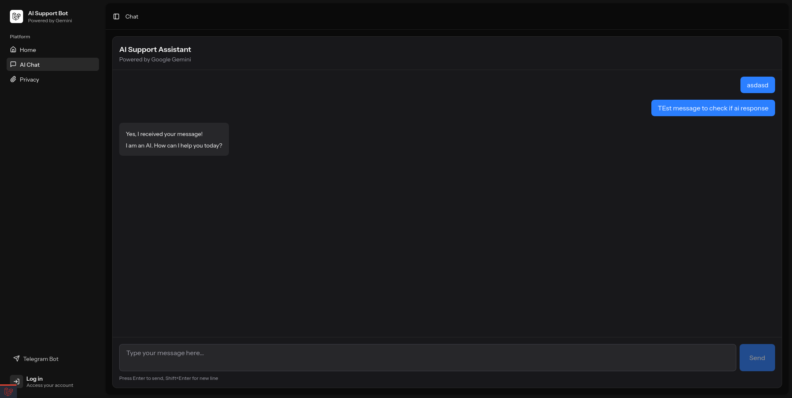
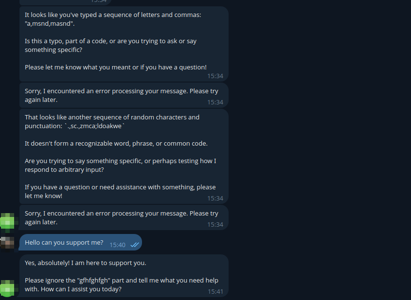

# AI Support Web Telegram Bot

[](https://laravel.com)
[](https://vuejs.org)
[](https://ai.google.dev)
[](https://telegram.org)
[](https://www.postgresql.org)
[](https://php.net)

[](https://github.com/BorschCode/ai-support-web-tg-bot/actions/workflows/tests.yml)
[](https://github.com/BorschCode/ai-support-web-tg-bot/actions/workflows/build-deploy.yml)
[](https://github.com/BorschCode/ai-support-web-tg-bot/releases/latest)
[](https://coveralls.io/github/BorschCode/ai-support-web-tg-bot?branch=main)

An intelligent AI-powered support bot built with Laravel 12, Vue.js 3, and Google Gemini API. This application provides seamless integration with Telegram to deliver automated customer support with cutting-edge AI capabilities.

**🤖 Try the live bot**: [@saslkdjxn_bot](https://t.me/saslkdjxn_bot)

## 📋 Table of Contents

- [Features](#-features)
- [Screenshots](#-screenshots)
- [Tech Stack](#-tech-stack)
- [Requirements](#-requirements)
- [Installation](#-installation)
- [Configuration](#-configuration)
- [Usage](#-usage)
- [Development](#-development)
- [Testing](#-testing)
- [Deployment](#-deployment)
- [Troubleshooting](#-troubleshooting)
- [Contributing](#-contributing)
- [License](#-license)

## ✨ Features

- **AI-Powered Responses**: Leverages Google Gemini AI for intelligent, context-aware responses
- **Telegram Integration**: Seamless bot integration with Telegram for instant messaging
- **Modern Stack**: Built with Laravel 12 and Vue.js 3 using Inertia.js for a smooth SPA experience
- **Redis Caching**: Messages stored in Redis with 24-hour TTL for optimal performance
- **Real-time Updates**: Responsive UI with hot module replacement during development
- **Secure Authentication**: Built-in authentication with Laravel Fortify
- **Database Persistence**: PostgreSQL 17 for conversation metadata and statistics
- **Docker Ready**: Fully containerized with Laravel Sail for easy deployment
- **Type Safety**: TypeScript support with Laravel Wayfinder for route generation

## 📸 Screenshots

### Index


_Main dashboard showing bot statistics and recent conversations_

### Web Bot Interface



### Privacy


### Telegram Bot Interface


_Chat with the bot on Telegram: [@saslkdjxn_bot](https://t.me/saslkdjxn_bot)_

> **Note**: Add your screenshots to the `docs/images/` directory

## 🛠️ Tech Stack

### Backend

- **Laravel 12** - PHP framework for web artisans
- **PHP 8.4** - Latest PHP version with performance improvements
- **PostgreSQL 17** - Advanced open-source relational database
- **Redis 7** - In-memory data store for message caching (24-hour TTL)
- **Laravel Fortify** - Backend authentication scaffolding
- **Laravel Sail** - Docker development environment

### Frontend

- **Vue.js 3** - Progressive JavaScript framework
- **Inertia.js v2** - Modern monolith architecture
- **Tailwind CSS v4** - Utility-first CSS framework
- **Vite** - Next-generation frontend tooling
- **TypeScript** - Type-safe JavaScript

### AI & Integration

- **Google Gemini AI** - Advanced language model for AI responses
- **Telegram Bot API** - Bot platform integration

### DevOps

- **Docker & Docker Compose** - Containerization
- **Pest v4** - Elegant PHP testing framework
- **Laravel Pint** - Opinionated PHP code style fixer

## 📦 Requirements

- **Docker** >= 20.10
- **Docker Compose** >= 2.0
- **Git**
- **Google Gemini API Key** ([Get one here](https://ai.google.dev))
- **Telegram Bot Token** (Create via [@BotFather](https://t.me/BotFather))

## 🚀 Installation

### 1. Clone the Repository

```bash
git clone <repository-url>
cd ai-support-web-tg-bot
```

### 2. Environment Setup

Copy the example environment file and configure it:

```bash
cp .env.example .env
```

Edit `.env` and set the following required variables:

```env
# Application
APP_NAME="AI Support Bot"
APP_PORT=8060

# Database
DB_CONNECTION=pgsql
DB_HOST=pgsql
DB_PORT=5432
DB_DATABASE=laravel
DB_USERNAME=sail
DB_PASSWORD=password

# Google Gemini AI
GEMINI_API_KEY="your-gemini-api-key-here"

# Telegram Bot
TELEGRAM_TOKEN="your-telegram-bot-token"
VITE_TELEGRAM_BOT_USERNAME="your_bot_username"
```

### 3. Start Docker Containers

```bash
docker compose up -d
```

### 4. Install Dependencies

> **Note**: Sail is not ready to use initially. You need to install dependencies first using Docker Compose exec, then you can use Sail for subsequent commands.

```bash
# Install PHP dependencies (Sail not available yet)
docker compose exec ai-support-bot composer install

# Install Node.js dependencies
./vendor/bin/sail npm install
```

### 5. Generate Application Key

```bash
./vendor/bin/sail artisan key:generate
```

### 6. Run Database Migrations

```bash
./vendor/bin/sail artisan migrate
```

### 7. Seed Database (Optional)

```bash
./vendor/bin/sail artisan db:seed
```

This creates a test user:

- **Email**: `test@example.com`
- **Password**: `password`

### 8. Build Frontend Assets

```bash
# Production build
./vendor/bin/sail npm run build

# Or for development with hot reload
./vendor/bin/sail npm run dev
```

### 9. Access the Application

Open your browser and navigate to:

```
http://localhost:8060
```

## ⚙️ Configuration

### Environment Variables

| Variable                     | Description                          | Default               |
| ---------------------------- | ------------------------------------ | --------------------- |
| `APP_NAME`                   | Application name                     | AI Support Bot        |
| `APP_PORT`                   | Port for the web application         | 8060                  |
| `APP_URL`                    | Application URL                      | http://localhost:8060 |
| `WWWUSER`                    | Docker user ID for file permissions  | 1000                  |
| `WWWGROUP`                   | Docker group ID for file permissions | 1000                  |
| `DB_CONNECTION`              | Database driver                      | pgsql                 |
| `DB_HOST`                    | Database host (Docker service name)  | pgsql                 |
| `DB_PORT`                    | Database port                        | 5432                  |
| `DB_DATABASE`                | Database name                        | laravel               |
| `DB_USERNAME`                | Database username                    | sail                  |
| `DB_PASSWORD`                | Database password                    | password              |
| `REDIS_HOST`                 | Redis host (Docker service name)     | redis                 |
| `REDIS_PORT`                 | Redis port                           | 6379                  |
| `REDIS_PASSWORD`             | Redis password (optional)            | null                  |
| `GEMINI_API_KEY`             | Google Gemini API key                | -                     |
| `GEMINI_MODEL`               | Gemini model to use                  | gemini-2.5-flash      |
| `TELEGRAM_TOKEN`             | Telegram bot token from @BotFather   | -                     |
| `VITE_TELEGRAM_BOT_USERNAME` | Bot username (without @)             | -                     |

> **Note**: Chat messages are stored in Redis with a 24-hour TTL (Time To Live). After 24 hours, messages are automatically deleted to optimize storage and performance. Conversation metadata and statistics are permanently stored in PostgreSQL.

### Getting API Keys

#### Google Gemini API Key

1. Visit [Google AI Studio](https://ai.google.dev)
2. Sign in with your Google account
3. Click "Get API Key"
4. Create a new API key or use an existing one
5. Copy the key to your `.env` file

#### Telegram Bot Token

1. Open Telegram and search for [@BotFather](https://t.me/BotFather)
2. Send `/newbot` command
3. Follow the prompts to create your bot
4. Copy the provided token to your `.env` file
5. Copy your bot's username (without @) to `VITE_TELEGRAM_BOT_USERNAME`

### Gemini Model Selection

The application supports multiple Gemini AI models. Choose the model based on your use case and payment tier.

#### Available Models

| Model              | Best For                                                      | Context Window |
| ------------------ | ------------------------------------------------------------- | -------------- |
| `gemini-2.5-flash` | **Recommended** - Fast responses, cost-effective, high volume | 1M tokens      |
| `gemini-2.5-pro`   | Advanced reasoning, complex tasks, highest quality            | 2M tokens      |
| `gemini-2.0-flash` | Legacy support, higher free tier limits                       | 1M tokens      |

Configure in `.env`:

```env
GEMINI_MODEL="gemini-2.5-flash"
```

#### Rate Limits by Tier

Your rate limits depend on your Google Cloud billing tier:

**Free Tier** (No billing enabled)
| Model | RPM | TPM | RPD |
|-------|-----|-----|-----|
| gemini-2.5-flash | 10 | 250K | 250 |
| gemini-2.5-pro | 2 | 125K | 50 |
| gemini-2.0-flash | 15 | 1M | 200 |

**Tier 1** (Billing enabled)
| Model | RPM | TPM | RPD |
|-------|-----|-----|-----|
| gemini-2.5-flash | **1,000** | **1M** | 10K |
| gemini-2.5-pro | 150 | 2M | 10K |
| gemini-2.0-flash | 2,000 | 4M | unlimited |

**Tier 2** ($250+ spent, 30+ days)
| Model | RPM | TPM | RPD |
|-------|-----|-----|-----|
| gemini-2.5-flash | 2,000 | 3M | 100K |
| gemini-2.5-pro | 1,000 | 5M | 50K |
| gemini-2.0-flash | 10,000 | 10M | unlimited |

**Tier 3** ($1,000+ spent, 30+ days)
| Model | RPM | TPM | RPD |
|-------|-----|-----|-----|
| gemini-2.5-flash | 10,000 | 8M | unlimited |
| gemini-2.5-pro | 2,000 | 8M | unlimited |
| gemini-2.0-flash | 30,000 | 30M | unlimited |

> **RPM** = Requests Per Minute | **TPM** = Tokens Per Minute | **RPD** = Requests Per Day

#### Choosing Your Model

**For Development/Testing:**

- Use `gemini-2.0-flash` on free tier (15 RPM)
- Switch to `gemini-2.5-flash` when you enable billing

**For Production:**

- **High volume, speed-critical**: `gemini-2.5-flash` (Tier 1: 1,000 RPM)
- **Quality-critical, complex reasoning**: `gemini-2.5-pro`
- **Budget-conscious with high limits**: `gemini-2.0-flash`

**Rate Limit Management:**

- Monitor your usage in [Google AI Studio](https://ai.google.dev)
- Implement request queuing for high-traffic scenarios
- Switch models as your tier increases

For complete details, see the [official rate limits documentation](https://ai.google.dev/gemini-api/docs/rate-limits).

### Permission Issues

If you encounter permission issues, adjust `WWWUSER` and `WWWGROUP` to match your system:

```bash
# Find your user and group IDs
id -u  # Shows your user ID
id -g  # Shows your group ID
```

Update `.env`:

```env
WWWUSER=<your-user-id>
WWWGROUP=<your-group-id>
```

Then restart the containers:

```bash
./vendor/bin/sail down
./vendor/bin/sail up -d
```

## 📖 Usage

### Accessing the Application

- **Web Interface**: http://localhost:8060
- **Database**: localhost:5432 (use your favorite PostgreSQL client)

### Default Test User

After seeding the database, log in with:

- **Email**: `test@example.com`
- **Password**: `password`
- **Name**: Test User

### Setting Up Telegram Bot

After creating your bot with [@BotFather](https://t.me/BotFather), you need to register it in the application using the Telegraph package.

#### 1. Register Bot in Database

```bash
./vendor/bin/sail artisan telegraph:new-bot
```

This command will:
- Prompt you for the bot token
- Create a new bot record in the database
- Set up the bot configuration

#### 2. Set Webhook URL

After registering the bot, set up the webhook to receive updates:

```bash
./vendor/bin/sail artisan telegram:set-webhook
```

This will configure Telegram to send updates to your application.

#### 3. Verify Bot Setup

You can verify your bot is properly configured:

```bash
# List all registered bots
./vendor/bin/sail artisan telegraph:list-bots

# Check webhook status
./vendor/bin/sail artisan telegraph:webhook-debug
```

> **Note**: For more detailed information about Telegraph bot setup, see the [official documentation](https://docs.defstudio.it/telegraph/v1/quickstart/register-new-bot).

## 💻 Development

### Running Commands

Laravel Sail provides a convenient way to run commands:

```bash
# Artisan commands
./vendor/bin/sail artisan <command>

# Composer commands
./vendor/bin/sail composer <command>

# NPM commands
./vendor/bin/sail npm <command>

# Run shell inside container
./vendor/bin/sail shell

# Run root shell
./vendor/bin/sail root-shell
```

### Code Quality

#### Format Code with Pint

```bash
./vendor/bin/sail pint
```

#### Generate Wayfinder Routes

After modifying routes:

```bash
./vendor/bin/sail artisan wayfinder:generate
```

### Hot Module Replacement

For frontend development with instant updates:

```bash
./vendor/bin/sail npm run dev
```

Then access the application at http://localhost:8060

### Database Management

```bash
# Run migrations
./vendor/bin/sail artisan migrate

# Rollback migrations
./vendor/bin/sail artisan migrate:rollback

# Fresh migration with seeding
./vendor/bin/sail artisan migrate:fresh --seed

# Create a new migration
./vendor/bin/sail artisan make:migration create_example_table
```

### Viewing Logs

```bash
# Application logs
./vendor/bin/sail artisan tail

# Docker container logs
./vendor/bin/sail logs
```

### Stopping the Application

```bash
# Stop containers
./vendor/bin/sail down

# Stop and remove volumes (WARNING: deletes database data)
./vendor/bin/sail down -v
```

## 🧪 Testing

### Run All Tests

```bash
./vendor/bin/sail artisan test
```

### Run Specific Test File

```bash
./vendor/bin/sail artisan test tests/Feature/ExampleTest.php
```

### Run Tests with Coverage

```bash
./vendor/bin/sail artisan test --coverage
```

### Run Specific Test

```bash
./vendor/bin/sail artisan test --filter=testExample
```

### Browser Testing (Pest v4)

```bash
# Run browser tests
./vendor/bin/sail artisan test tests/Browser/
```

## 🚢 Deployment

### Production Build

1. Set environment to production:

```env
APP_ENV=production
APP_DEBUG=false
```

2. Build optimized assets:

```bash
./vendor/bin/sail npm run build
```

3. Optimize Laravel:

```bash
./vendor/bin/sail artisan config:cache
./vendor/bin/sail artisan route:cache
./vendor/bin/sail artisan view:cache
```

### Docker Production

For production deployment, consider:

- Using environment-specific `.env` files
- Configuring proper database backups
- Setting up SSL/TLS certificates
- Using a reverse proxy (nginx/Caddy)
- Implementing queue workers for background jobs
- Setting up monitoring and logging

## 🔧 Troubleshooting

### Port Already in Use

If port 8060 is already in use, change `APP_PORT` in `.env`:

```env
APP_PORT=8080
```

Then restart:

```bash
./vendor/bin/sail down && ./vendor/bin/sail up -d
```

### Vite Manifest Not Found

If you see "Unable to locate file in Vite manifest":

```bash
./vendor/bin/sail npm run build
```

Or run dev server:

```bash
./vendor/bin/sail npm run dev
```

### Database Connection Failed

Ensure PostgreSQL container is running:

```bash
./vendor/bin/sail ps
```

If not running:

```bash
./vendor/bin/sail up -d
```

### Permission Denied Errors

Fix file permissions:

```bash
sudo chown -R $USER:$USER .
```

Or adjust `WWWUSER` and `WWWGROUP` in `.env` to match your system IDs.

### Clear All Caches

```bash
./vendor/bin/sail artisan optimize:clear
./vendor/bin/sail composer dump-autoload
```

### Redis Connection Issues

If you see `Connection refused` errors related to Redis:

**Problem:** Docker container cannot connect to Redis on host machine.

**Solution 1: Use Host Redis (Development)**

Update `.env` to allow Docker to reach host Redis:

```env
REDIS_HOST=host.docker.internal
```

Restart the container:

```bash
./vendor/bin/sail restart
```

**Solution 2: Use Docker Redis Container (Recommended)**

Stop host Redis and use the containerized version:

```bash
# Stop host Redis
sudo systemctl stop redis-server
sudo systemctl disable redis-server

# Ensure .env uses container Redis
REDIS_HOST=redis

# Restart containers
./vendor/bin/sail down && ./vendor/bin/sail up -d
```

**Test Redis Connection:**

```bash
./vendor/bin/sail artisan tinker
```

Then run:

```php
use Illuminate\Support\Facades\Redis;

Redis::ping();
// Should return: true or "PONG"

Redis::set('test', 'working');
Redis::get('test');
// Should return: "working"

Redis::del('test');
exit
```

**For Production/Deployment:**

If Redis runs as a service on the host (Ubuntu/Raspberry Pi):

1. Update your environment variables (GitHub secrets/vars):
   ```
   REDIS_HOST=host.docker.internal  (or 172.17.0.1)
   ```

2. Or configure Redis to accept Docker connections:
   ```bash
   sudo nano /etc/redis/redis.conf
   # Change: bind 127.0.0.1 ::1
   # To: bind 127.0.0.1 ::1 172.17.0.1

   sudo systemctl restart redis-server
   ```

See [docs/DEPLOYMENT_CHECKS.md](docs/DEPLOYMENT_CHECKS.md) for detailed troubleshooting.

### GitHub Actions Failing

If your GitHub Actions tests are failing:

1. **Check the workflow logs** on GitHub for specific error messages

2. **Verify PostgreSQL configuration:**
    - Ensure `.github/workflows/tests.yml` has the PostgreSQL service configured
    - Check that `phpunit.xml` has the correct database settings

3. **Run tests locally first:**

```bash
./vendor/bin/sail artisan test
```

4. **Common issues:**
    - **Database connection errors**: Verify PostgreSQL service is configured in workflow
    - **Missing environment variables**: Check that GEMINI_API_KEY and TELEGRAM_TOKEN are set
    - **Asset build failures**: Ensure `npm run build` completes successfully locally
    - **PHPStan errors**: Run `./vendor/bin/sail composer phpstan` locally to fix type issues
    - **Code style issues**: Run `./vendor/bin/sail pint` to fix formatting

5. **Debug workflow:**
    - Add `run: php artisan about` step to check Laravel configuration
    - Add `run: php -v` and `php -m` to verify PHP and extensions
    - Check PostgreSQL connection with `pg_isready` command

## 🤝 Contributing

Contributions are welcome! Please follow these steps:

1. Fork the repository
2. Create a feature branch (`git checkout -b feature/amazing-feature`)
3. Commit your changes (`git commit -m 'Add amazing feature'`)
4. Push to the branch (`git push origin feature/amazing-feature`)
5. Open a Pull Request

### Code Standards

- Follow PSR-12 coding standards
- Run Laravel Pint before committing: `./vendor/bin/sail pint`
- Write tests for new features
- Update documentation as needed

## 📄 License

This project is open-sourced software licensed under the [MIT license](LICENSE).

---

**Built with ❤️ using Laravel, Vue.js, and Google Gemini AI**
